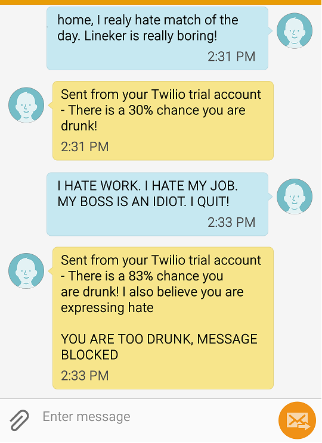

# DrunkenTextGuard

Pitch from the "AI Hackathon: Ireland's First AI Hack - organized by Dublin AI" (https://www.meetup.com/DataScientistsIreland/events/237365278/)

Idea: prevent you from sending Drunk text messages.

Uses Twilio to programmatically make and receive the text messages using its web service APIs. 

## Example:

## How to Run:

	----

## Model

Part 1 (Text Based):
	
	Given the short amout of time and the fact that is not easy to find training data for this use case, we got data from twitter and made the assumption that any message with the word "drunk" in it was written by a drunk person;
	We also added a bunch of swear word to the "drunk" text file - so beware when opening it.
	
	Again, given the lack of good data and the short time, no effort was spent of finding a good model. A simple random forest was used. There is, of course, room for improvement here.

	* Create a TextBasedClassifier object:
	t = TextBasedClassifier()
	* Train the data (only once - model expects drunk and not_drunk text files on the model data)
	df = t.TrainTextBasedClassifier()
	*Consume the model:
	t.Predict('I am drunk')

Part 2 (Geolocator):

	Uses googles geolocator to determine where you have been in the last 2 hours. 
	This model hardcodes locations near a pub (to increase the likelihood of being drunk) but the end goal would be to get the actual user location
	
	lAnalyzer = la.LocationAnalyzer()
	result = lAnalyzer.VisitedPlaces(lat,lon)

Part 3 (Alyen Sentiment):

	Uses Aylien API (http://production.tap.aylien.com/) to determin the sentiment of the sentence. 
	
	emotionGetter = aly.AylienEmotionClassifier()
    my_emotion_score = emotionGetter.getEmotion(text)    